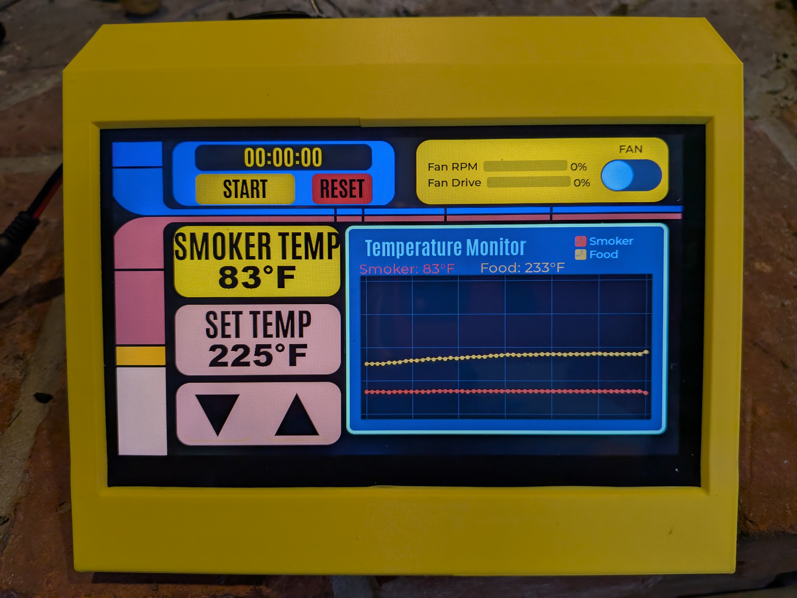

# DIY Smoker Controller System

A dual-ESP32 based smart controller system for pellet or Gravity smokers, featuring a touchscreen display unit and WiFi-enabled web interface for remote monitoring and control. 

I would like to talk about the dual ESP32 design. I originally had planned to use just the display ESP32P4(with its ESP32-C6) however I found that the system lagged more than I was comfortable with and decided to add the ESP32-S3. I also went with the ESP32-S3-N16R8 version allowing for a large filesystem to store smoker logs which I plan to use for "recipes." I also liked the OTA option for the web server given its going to be difficult to update once installed in the smokers housing. I don't expect to need to update the display ESP32-P4 now that it is only driving the display, fan and tach.

This system is not intended to less expensive than other options out in the aftermarket stores. In fact with all the hardware testing I did it was notably more expensive than an existing product. However, now that it is done, I have exactly what I wanted, it is configurable and updatable in ways store bought options could never be. This has been a passion project that is now ready to be tested on my Masterbuilt Gravity smoker.

## ⚠️ Safety Warning

**🔥🔥This project involves controlling and working with fire. Use at your own risk.🔥🔥**

**IMPORTANT:**
- This software is provided as-is with no guarantees of safety or reliability
- You assume all responsibility for any damage, injury, or loss resulting from the use of this project
- Always follow proper fire safety protocols and never leave your smoker unattended
- Ensure your hardware setup meets all local electrical and fire safety codes
- The authors are not responsible for any accidents, fires, property damage, or injuries

**By using this project, you acknowledge these risks and agree to take full responsibility.**




## System Overview

This project consists of two ESP32 microcontrollers working together to provide comprehensive smoker monitoring and control:

```
┌─────────────────────────────────────────────────────────────────────────────┐
│                        SMOKER CONTROLLER SYSTEM                             │
├─────────────────────────────────────────────────────────────────────────────┤
│                                                                             │
│   ┌─────────────────────┐         UART           ┌─────────────────────┐    │
│   │    ESP32-P4         │◄──────────────────────►│    ESP32-S3         │    │
│   │  Display Controller │    (Bidirectional)     │    Web Server       │    │
│   └─────────────────────┘                        └─────────────────────┘    │
│            │                                              │                 │
│            │                                              │                 │
│            ▼                                              ▼                 │
│   ┌─────────────────────┐                        ┌─────────────────────┐    │
│   │ 1024x600 LCD        │                        │ WiFi / Web UI       │    │
│   │ Touchscreen         │                        │ MAX6675 Sensors     │    │
│   │ Fan PWM Control     │                        │ OTA Updates         │    │
│   │ PID Controller      │                        │ Temperature Sensing │    │
│   └─────────────────────┘                        └─────────────────────┘    │
│                                                                             │
└─────────────────────────────────────────────────────────────────────────────┘
```

### Build environment.
It is worth noting that I used the excelent [Arduinio Maker Workshop](https://github.com/thelastoutpostworkshop/arduino-maker-workshop) VSCode add on for these projects. Each one of the two projects included here includes the build profiles so assuming you use the same hardware you can comnpile it without any issues with libraries.


### ESP32-P4: Display Controller
**Location:** [DisplayControler/](DisplayControler/)

The display unit provides the physical user interface:
- 1024x600 LCD touchscreen with GT911 capacitive touch
- PID-based temperature control algorithm
- PWM fan control with RPM feedback
  - it is worth noting that the system does not have to drive a fan. With some minor changes this system could drive a servo to control an ball valve for example to control passive fire systems like other Gravity Smokers.
- Real-time temperature charting
- Cook timer functionality
- Safety watchdog (auto-disables fan if communication lost)
- [Ordered from here](https://www.aliexpress.com/p/tesla-landing/index.html?scenario=c_ppc_item_bridge&productId=1005009348846335&_immersiveMode=true&withMainCard=true&src=google&aff_platform=true&isdl=yhttps://www.aliexpress.com/p/tesla-landing/index.html?scenario=c_ppc_item_bridge&productId=1005009348846335&_immersiveMode=true&withMainCard=true&src=google&aff_platform=true&isdl=y)

### ESP32-S3: Web Server
**Location:** [SmokerWebServer/](SmokerWebServer/)

The web server module handles connectivity and sensing:
- WiFi connectivity with AP fallback for setup
- Mobile-friendly web dashboard
- MAX6675 thermocouple interfaces (smoker + food probes)
- WebSocket for real-time updates
- REST API for integration
- OTA (Over-The-Air) firmware updates
- mDNS support (`smoker.local`)
- [Example here from Amazon](https://www.amazon.ca/HiLetgo-ESP32-S3-ESP32-S3-DevKit-Bluetooth-Development/dp/B0CDWXWXCG)

## Features

### Temperature Monitoring
- Dual K-type thermocouple inputs (smoker chamber + food probe)
- Calibration offsets (-50 to +50°F) stored in non-volatile memory
- 2-hour temperature history with graphing both on display and webpage
- Real-time updates via WebSocket (1-second refresh)

### Temperature Control
- PID algorithm for precise temperature maintenance
- Configurable PID parameters (Kp, Ki, Kd) from the webpage
- Fan-based airflow control with RPM feedback
- Target temperature range: 150-500°F

### User Interface
- **Local:** 1024x600 touchscreen with intuitive controls
- **LCARS** interface. I'm a Trekie so I use the Star Trek TNG LCARS as my inspiration for the user interface on the touch screen 
- **Remote:** Responsive web interface accessible from any device
- Both interfaces show:
  - Current smoker and food temperatures
  - Target temperature with adjustment controls
  - Fan status, RPM, and PWM percentage
  - Cook timer with start/stop/reset

### Safety Features
- Temperature watchdog: Fan auto-disables if no data received for 10 seconds
- PID output limits for controlled operation
- Visual "NO LINK" indicator when communication is lost

## Hardware Requirements

### Components List

| Component                    | Quantity | Purpose                       |
|------------------------------|----------|-------------------------------|
| [ESP32-P4 Development Board](https://www.aliexpress.com/p/tesla-landing/index.html?scenario=c_ppc_item_bridge&productId=1005009348846335&_immersiveMode=true&withMainCard=true&src=google&aff_platform=true&isdl=yhttps://www.aliexpress.com/p/tesla-landing/index.html?scenario=c_ppc_item_bridge&productId=1005009348846335&_immersiveMode=true&withMainCard=true&src=google&aff_platform=true&isdl=y)   | 1        | Display controller               |
| [ESP32-S3-DevKitC-1 (N16R8)](https://www.amazon.ca/HiLetgo-ESP32-S3-ESP32-S3-DevKit-Bluetooth-Development/dp/B0CDWXWXCG)   | 1        | Web server, WiFi, sensors      |
| 1024x600 LCD (JD9165 driver) | 1        | Main display (Integrated)     |
| GT911 Touch Controller       | 1        | Touchscreen input (Integrated)|
| MAX6675 Thermocouple Module  | 2        | Temperature sensing           |
| K-type Thermocouple          | 2        | Smoker & food probes          |
| 4-wire PWM Fan               | 1        | Airflow control               |

### Pin Connections

#### ESP32-P4 (Display Controller)
| Function             | GPIO |
|----------------------|------|
| Fan PWM Output       | 28   |
| Fan Tachometer Input | 29   |
| Serial TX (to S3)    | 34   |
| Serial RX (from S3)  | 33   |

#### ESP32-S3 (Web Server)
| Function            | GPIO |
|---------------------|------|
| SPI CLK (MAX6675)   | 12   |
| SPI MISO (MAX6675)  | 13   |
| Smoker Probe CS     | 10   |
| Food Probe CS       | 11   |
| Serial TX (to P4)   | 17   |
| Serial RX (from P4) | 18   |

### Wiring Diagram

```
ESP32-S3                                ESP32-P4
┌─────────┐                            ┌─────────┐
│  GPIO17 ├───── TX ──────────────────►│ GPIO33  │ RX
│  GPIO18 │◄──── RX ───────────────────┤ GPIO34  │ TX
│         │                            │         │
│  GPIO12 ├──── CLK ──┐                │ GPIO28  ├──── PWM ────► Fan
│  GPIO13 ├──── MISO ─┤                │ GPIO29  │◄─── TACH ───┤
│  GPIO10 ├──── CS1 ──┼──► MAX6675s    └─────────┘
│  GPIO11 ├──── CS2 ──┘
│         │ 
└─────────┘ 

```

## Serial Communication Protocol

The two ESP32s communicate via UART using a simple text-based protocol:

### ESP32-S3 → ESP32-P4
```
TEMPS:smokerTemp,foodTemp              # Temperature readings (periodic)
CMD:SET_TEMP:225                       # Set target temperature
CMD:FAN:ON / CMD:FAN:OFF               # Fan control
CMD:TIMER:START / STOP / RESET         # Timer control
CMD:PID:Kp:Ki:Kd                       # Update PID parameters
CMD:GET_CONFIG                         # Request configuration
```

### ESP32-P4 → ESP32-S3
```
DATA:smokerTemp,foodTemp,setTemp,rpm,pwm,fanOn,timerMs,Kp,Ki,Kd
CONFIG:dispInterval,chartInterval,buttonHold,swapInterval,fadeDuration,Kp,Ki,Kd
```

## PID Tuning:
I used [this page](https://www.compuphase.com/electronics/reflowsolderprofiles.htm#_) to help me with the PID tuning. 
It help me know which numbers to change and how. I started with a P value of 20 and zero for both I and D. This worked fairly well but through iterative testing I settled on P=7 I=.01 and D=.2 Your setup may be different but the page above would help you alot. 

## Installation
I used the Arduino Maker Workshop plugin for VSCode so the Sketch.yaml file in both project folders contians the library data and versions so there should be no conflicts when building.

## Initial Setup

### WiFi Configuration

1. On first boot, the ESP32-S3 creates an access point:
   - **SSID:** `SmokerSetup`
   - **Password:** `smoker123`
   - **IP:** `192.168.4.1`

2. Connect to the network and open `http://192.168.4.1`

3. Enter your WiFi credentials and save

4. The device restarts and connects to your network

### Accessing the Web Interface

After WiFi setup:
- **mDNS:** `http://smoker.local`
- **IP Address:** Check serial monitor or router DHCP list

## Usage

### Local (Touchscreen)
- **Temperature:** Tap UP/DOWN to adjust target, display alternates between smoker and food temps
- **Fan:** Toggle ON/OFF switch
- **Timer:** START/STOP and RESET buttons

### Remote (Web Interface)
- Navigate to `http://smoker.local`
- All controls mirror the touchscreen interface
- View 2-hour temperature history chart
- Adjust calibration offsets in Settings
- Tune PID parameters if needed
- Record, edit and save smoking sessions in database


### OTA Updates
1. Navigate to `http://smoker.local/update`
2. Upload new firmware binary
3. Device restarts automatically

## API Reference

### REST Endpoints
| Endpoint           | Method   | Description          |
|--------------------|----------|----------------------|
| `/`                | GET      | Web dashboard        |
| `/api/state`       | GET      | Current state (JSON) |
| `/api/command`     | POST     | Send command         |
| `/api/calibration` | GET/POST | Calibration offsets  |
| `/wifi/status`     | GET      | WiFi status          |
| `/wifi`            | POST     | Configure WiFi       |
| `/update`          | GET      | OTA update page      |

### WebSocket
Connect to `/ws` for real-time state updates at 1Hz.

## Project Structure

```
SMOKER Build/
├── README.md                              # This file
├── partitions.csv                         # ESP32 partition layout
├── 5-Schematic/                           # Hardware schematics of display board
│   ├── 1_PWR.png
│   ├── 2_LCD.png
│   ├── 3_ESP32-P4.png
│   ├── 4_CONN.png
│   ├── 5_ESP32-C6.png
│   ├── 6_USB.png
│   └── 7_CODEC.png
├── DisplayControler/                       # ESP32-P4 Display Controller
│   ├── DisplayControler.ino
│   ├── pins_config.h
│   ├── style.h
│   ├── lv_conf.h
│   └── src/
│       ├── lcd/                           # LCD drivers
│       └── touch/                         # Touch drivers
└── SmokerWebServer/                       # ESP32-S3 Web Server
    ├── SmokerWebServer.ino
    ├── README.md
    └── (web interface files)
```

## Configuration Defaults

### PID Parameters
| Parameter | Default |
|-----------|---------|
| Kp        | 7.0     |
| Ki        | 0.0     |
| Kd        | 0.2     |

### Temperature Limits
| Setting | Value |
|---------|-------|
| Minimum | 150°F |
| Maximum | 500°F |
| Default | 225°F |

### Timing
| Setting          | Default    |
|------------------|------------|
| Display Update   | 500ms      |
| Chart Update     | 60 seconds |
| WebSocket Update | 1 second   |
| Watchdog Timeout | 10 seconds |

## Troubleshooting

### Display shows "NO LINK"
- Check UART wiring between ESP32-P4 and ESP32-S3
- Verify TX connects to RX and vice versa
- Ensure both boards are powered

### Temperature shows -999
- Check MAX6675 wiring (CS, CLK, MISO)
- Verify thermocouple connections
- Check for open circuit in thermocouple

### Cannot connect to web interface
- Verify ESP32-S3 is connected to WiFi (check serial output)
- Try IP address instead of mDNS
- Ensure you're on the same network

### Fan not responding
- Check PWM wiring to GPIO 28 on ESP32-P4
- Verify fan receives proper power
- Check tachometer feedback wiring

## License

This project is licensed under the MIT License.

## Acknowledgments

- ESP32 Arduino Core developers
- LVGL graphics library team
- AsyncWebServer library maintainers
- ElegantOTA for OTA updates
- Created with assistance from Claude (Anthropic)
